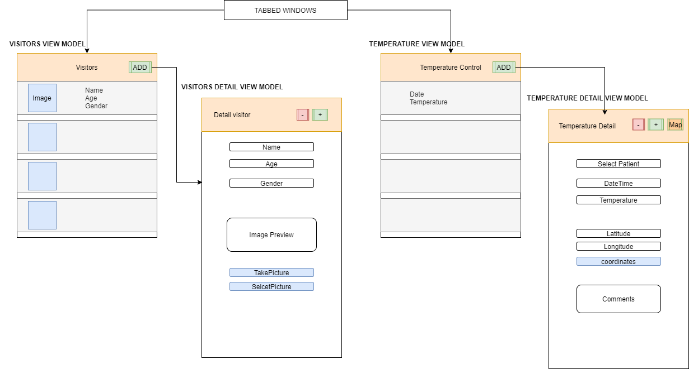

# Temperature Control

This is an App in Xamarin.Forms for a temperature control, the information will be
saved in local storage using SQLite. The application follows the MVVM design pattern and is built with tabbed windows.

In the app there is a menu with tabs to access visitors where they can
perform all the CRUD, and a second tab to manage the records of
temperature.

The modules and functionalities are:
- CRUD of visitors. Visitors are saved with their name, age, gender and photograph (taken with the
camera or selected from the galery).
- CRUD of temperature record. A temperature measurement is saved with the date and time,
coordinates of the current location, the temperature that the visitor has at that time and it will put some open comments.
- Map displaying the location where the temperature was taken.

## Structure diagram

## Requirements
* To use the map, it is necessary to create a [Google Cloud Platform](https://console.cloud.google.com/getting-started) account and enable an API KEY from Maps SDK for Android, after that it must be placed in the android manifest file.
